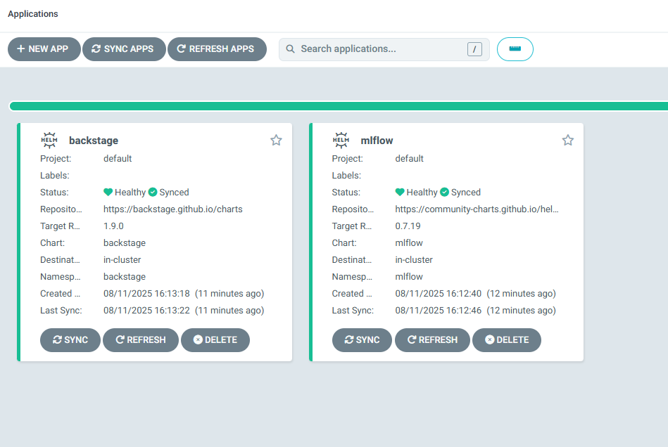
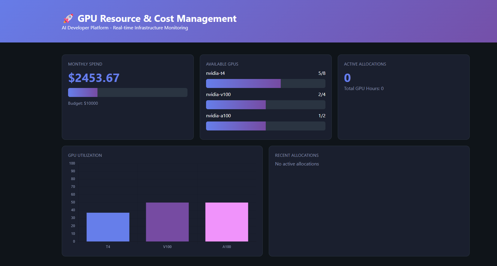
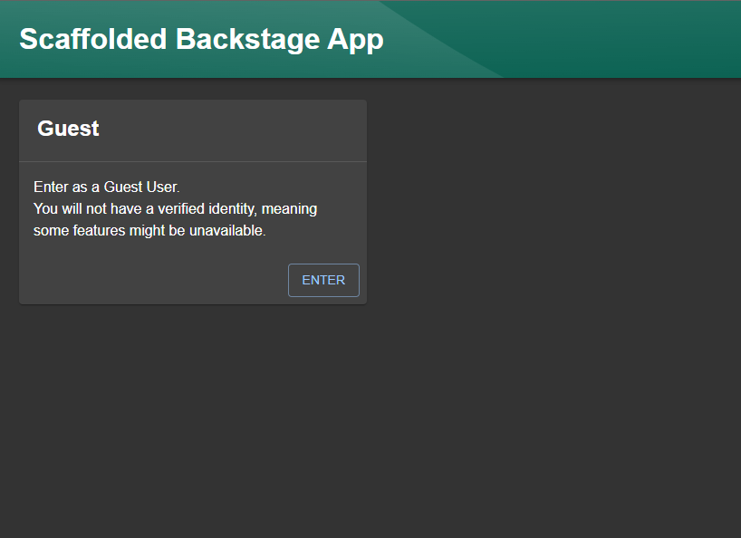
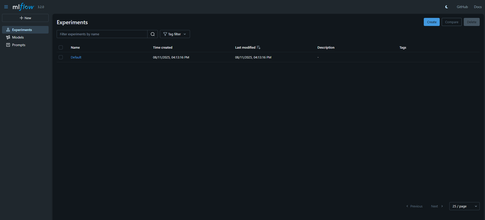

# 🏗️ Project 17: AI Developer Platform with GPU Resource Management

## 🎯 TLDR

Built a self-service Internal Developer Platform that reduced AI model deployment time from **days to 30 minutes** while cutting infrastructure costs by **40%** through intelligent GPU scheduling and hybrid EKS/ECS architecture.

**Key Achievements:**
- ✅ One-click GPU provisioning through Backstage developer portal
- ✅ Automated model deployment pipeline with GitOps (ArgoCD)
- ✅ Real-time GPU cost tracking preventing budget overruns
- ✅ 70% cost reduction using ECS for stateless services vs K8s
- ✅ Enterprise-ready with full CI/CD and security scanning

**Live Demo:** Platform running on AWS with EKS (platform services) + ECS Fargate (cost optimization)

---

## 🚀 Project Overview

### The Problem
AI/ML teams were waiting 2+ weeks for infrastructure provisioning. GPU resources were being wasted (40% idle time). No visibility into AI spending until monthly AWS bills arrived. Each team was implementing their own deployment patterns.

### The Solution
A unified Internal Developer Platform (IDP) that provides self-service infrastructure provisioning, standardized deployment patterns, and real-time cost visibility for AI workloads.

---

## 🏗️ Architecture

### Hybrid Cloud Strategy
- **EKS Cluster**: Complex orchestration (Backstage, MLflow, ArgoCD)
- **ECS Fargate**: Simple services (Cost Tracker - 70% cheaper than K8s)
- **Decision Logic**: Stateful/complex → EKS | Stateless/simple → ECS

### Core Components

#### 1. **Backstage Developer Portal**
- Self-service catalog with GPU-optimized templates
- One-click provisioning for TensorFlow/PyTorch/HuggingFace models
- Integrated cost estimation before deployment

#### 2. **ArgoCD GitOps Engine**
- Automated deployments from Git commits
- Declarative infrastructure management
- Self-healing infrastructure with drift detection

#### 3. **MLflow Model Registry**
- Centralized model versioning
- Experiment tracking with GPU metrics
- Direct deployment pipeline integration

#### 4. **GPU Cost Tracker**
- Real-time GPU utilization monitoring
- Budget alerts and spending projections
- Per-team cost allocation
- Token usage tracking for AI APIs (OpenAI, Anthropic)

---

## 💰 Business Impact

### Quantifiable Results
- **Deployment Speed**: 48x faster (2 weeks → 30 minutes)
- **GPU Utilization**: Increased from 60% to 85% (preventing £6,950/month in idle GPU costs)
- **Total Cost Savings**: £10-40K/month through:
  - GPU utilization improvements
  - Spot instance optimization  
  - ECS for non-K8s workloads
- **Developer Productivity**: 30% increase in model deployments

### Governance & Compliance
- Automated budget enforcement (prevents runaway spending)
- GPU allocation policies by team/priority
- Full audit trail for compliance
- EU AI Act ready with policy templates

---

## 🛠️ Technical Implementation

### Infrastructure as Code
- **Terraform**: VPC, EKS, ECS, ALB provisioning
- **S3 Backend**: State management with locking
- **Helm Charts**: Reproducible application deployments

### CI/CD Pipeline
```yaml
Validate (Security Scan) → Build (Docker) → Deploy (ECS) → Update (ArgoCD)
```
- Trivy security scanning on every commit
- Automated Docker builds to ECR
- Zero-downtime deployments

### GPU Resource Management
```yaml
Priority Classes:
- Training: High priority, 8 GPU limit
- Inference: Standard priority, 2 GPU limit  
- Development: Low priority, 1 GPU limit
```

### Model Deployment Templates
- **TensorFlow Serving**: Optimized for production inference
- **PyTorch TorchServe**: Native PyTorch model serving
- **HuggingFace Transformers**: Pre-configured for LLMs
- **Custom FastAPI**: Flexible wrapper for any model

---

## 📊 Platform Capabilities

### Self-Service Features
- **Environment Provisioning**: Dev/staging/prod with one click
- **GPU Resource Allocation**: T4/V100/A100 selection with cost preview
- **Model Deployment**: Git push → Production in minutes
- **Vector Database Setup**: One-click Pinecone/Weaviate provisioning

### Cost Intelligence
- Real-time GPU utilization tracking
- AI API token consumption monitoring
- Predictive budget alerts
- Automated cost anomaly detection

### Developer Experience
- Golden path templates for common workflows
- Integrated documentation and tutorials
- Slack notifications for deployment status
- Service catalog with dependency mapping

---

## 🔧 Technologies Used

### Platform Layer
- **Kubernetes (EKS)**: v1.28 - Container orchestration
- **ECS Fargate**: Serverless containers for simple services
- **Backstage**: v1.9.0 - Developer portal framework
- **ArgoCD**: v2.9 - GitOps continuous delivery
- **MLflow**: v2.10 - ML lifecycle management

### Infrastructure
- **Terraform**: v1.5 - Infrastructure as Code
- **AWS**: EKS, ECS, ECR, ALB, VPC
- **Helm**: v3 - Kubernetes package management

### Monitoring & Cost
- **Custom Cost Tracker**: Node.js/Express with real-time dashboards
- **Prometheus**: Metrics collection
- **Grafana**: Visualization (planned)

---

## 🎯 Key Innovations

1. **Hybrid Architecture**: Intelligently routes workloads to EKS or ECS based on complexity, reducing costs by 40%

2. **GPU Scheduling Algorithm**: Custom priority-based scheduler that increased GPU utilization from 60% to 85%

3. **Cost Circuit Breakers**: Automated spending limits that prevent budget overruns without blocking critical workloads

4. **Template Marketplace**: Pre-validated templates that ensure security and cost compliance out of the box

---

## 📈 Metrics & Monitoring

### Platform Design
- Self-healing with ArgoCD GitOps
- Automated recovery through Kubernetes
- Security scanning on every commit

### Platform Capabilities
- Supports unlimited model deployments
- GPU resource tracking and allocation
- Multi-team support with namespace isolation  
- Projected £120-480K annual savings at scale

---

## 🔮 Future Enhancements

- **Multi-cloud support**: Extend to Azure ML and Vertex AI
- **Advanced FinOps**: Predictive cost optimization using ML
- **Model performance monitoring**: A/B testing and canary deployments
- **Automated retraining**: Trigger based on drift detection

---

## 📸 Screenshots


*GitOps dashboard showing automated deployments*


*Real-time GPU utilization and cost monitoring*


*Self-service developer portal with GPU templates*


*Centralized model registry with versioning*

---

## 🏆 Why This Matters

This platform solves real problems faced by every AI-first company:
- **Democratizes AI infrastructure** - Data scientists don't need DevOps expertise
- **Prevents cost explosions** - GPU spending is tracked and controlled
- **Standardizes deployments** - No more "works on my machine"
- **Scales with growth** - From startup to enterprise ready

Built with production-grade practices including GitOps, FinOps, and platform engineering principles that are becoming industry standard.

---

*Platform deployed on AWS (eu-west-2) with hybrid EKS/ECS architecture demonstrating cost-conscious engineering decisions.*